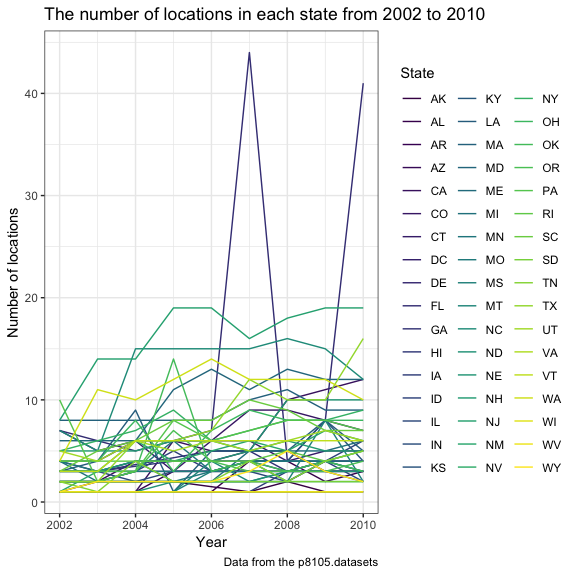

p8105\_hw3\_tl2882
================
Tian Li
2018-10-09

``` r
# install.packages("devtools")
devtools::install_github("p8105/p8105.datasets")
```

    ## Skipping install of 'p8105.datasets' from a github remote, the SHA1 (21f5ad1c) has not changed since last install.
    ##   Use `force = TRUE` to force installation

``` r
library(p8105.datasets)
```

Problem 1
=========

Read and clean brfss\_smart2010
-------------------------------

``` r
brfss = brfss_smart2010 %>% 
  janitor::clean_names() %>%
  filter(topic == "Overall Health") %>% 
  mutate(response = factor(response, levels = c("Excellent", "Very good", "Good", "Fair", "Poor"))) %>% 
  arrange(year, locationdesc, response)
```

Problem 1.1
-----------

``` r
brfss %>%  
  filter(year == "2002") %>% 
  group_by(locationabbr) %>%
  summarize(n_locations = n_distinct(locationdesc)) %>% 
  filter(n_locations == 7)
```

    ## # A tibble: 3 x 2
    ##   locationabbr n_locations
    ##   <chr>              <int>
    ## 1 CT                     7
    ## 2 FL                     7
    ## 3 NC                     7

In 2002, CT, FL, and NC states were observed at 7 locations.

Problem 1.2
-----------

``` r
brfss %>%  
  group_by(year, locationabbr) %>%
  summarize(n_locations = n_distinct(locationdesc)) %>%
  ggplot(aes(x = year, y = n_locations, color = locationabbr)) + 
    geom_line() + 
    labs(title = "The number of locations in each state from 2002 to 2010",
         x = "Year", 
         y = "Number of locations", 
         caption = "Data from the p8105.datasets") + 
    viridis::scale_color_viridis(name = "State", discrete = TRUE) +
    theme(legend.position = "right")
```



This is the “spaghetti plot” that shows the number of locations in each state from 2002 to 2010.
Y is "Number of observations", X is "Year", and each line represents a different state.
