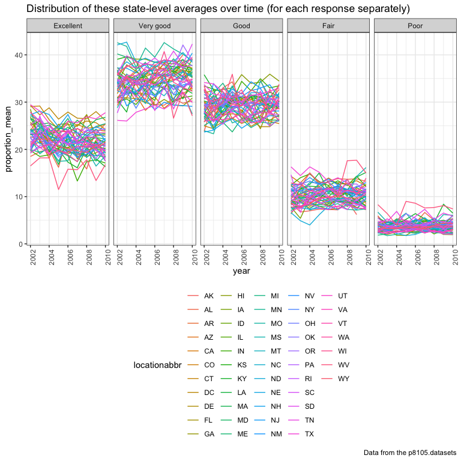

p8105\_hw3\_tl2882
================
Tian Li
2018-10-09

``` r
# install.packages("devtools")
devtools::install_github("p8105/p8105.datasets")
```

    ## Skipping install of 'p8105.datasets' from a github remote, the SHA1 (21f5ad1c) has not changed since last install.
    ##   Use `force = TRUE` to force installation

``` r
library(p8105.datasets)
```

Problem 1
=========

Read and clean brfss\_smart2010
-------------------------------

``` r
brfss = brfss_smart2010 %>% 
  janitor::clean_names() %>%
  filter(topic == "Overall Health") %>% 
  mutate(response = factor(response, levels = c("Excellent", "Very good", "Good", "Fair", "Poor"))) %>% 
  arrange(year, locationdesc, response)
```

Problem 1.1
-----------

``` r
brfss %>%  
  filter(year == "2002") %>% 
  group_by(locationabbr) %>%
  summarize(n_locations = n_distinct(locationdesc)) %>% 
  filter(n_locations == 7)
```

    ## # A tibble: 3 x 2
    ##   locationabbr n_locations
    ##   <chr>              <int>
    ## 1 CT                     7
    ## 2 FL                     7
    ## 3 NC                     7

In 2002, CT, FL, and NC states were observed at 7 locations.

Problem 1.2
-----------

``` r
brfss %>%  
  group_by(year, locationabbr) %>%
  summarize(n_locations = n_distinct(locationdesc)) %>%
  ggplot(aes(x = year, y = n_locations, color = locationabbr)) + 
    geom_line() + 
    labs(title = "The number of locations in each state from 2002 to 2010",
         x = "Year", 
         y = "Number of locations", 
         caption = "Data from the p8105.datasets") + 
    viridis::scale_color_viridis(name = "State", discrete = TRUE) +
    theme(legend.position = "right")
```


This is the “spaghetti plot” that shows the number of locations in each state from 2002 to 2010.
Y is "Number of observations", X is "Year", and each line represents a different state.

Problem 1.3
-----------

``` r
brfss %>%  
  filter(year == "2002" | year == "2006" | year == "2010") %>% 
  filter(locationabbr == "NY", response == "Excellent") %>%
  group_by(year) %>% 
  summarize(excellent_mean = mean(data_value),
            excellent_sd = sd(data_value)) %>% 
  knitr::kable(digits = 1)
```

|  year|  excellent\_mean|  excellent\_sd|
|-----:|----------------:|--------------:|
|  2002|             24.0|            4.5|
|  2006|             22.5|            4.0|
|  2010|             22.7|            3.6|

This is the table showing, for the years 2002, 2006, and 2010, the mean (as in "excellent\_mean") and standard deviation (as in "excellent\_sd") of the proportion of “Excellent” responses across locations in NY State.

Problem 1.4
-----------

``` r
brfss %>% 
  group_by(year, locationabbr, response) %>% 
  summarize(proportion_mean = mean(data_value)) %>% 
  ggplot(aes(x = year, y = proportion_mean, color = locationabbr)) + 
    geom_line() + 
    labs(
      title =
        "Distribution of these state-level averages over time (for each response separately)",
      caption = "Data from the p8105.datasets") + 
    theme(axis.text.x = element_text(angle = 90)) +
    facet_grid(~response) + 
    viridis::scale_fill_viridis(discrete = TRUE)
```

    ## Warning: Removed 1 rows containing missing values (geom_path).



-   I chose "geom\_line" because line chart shows the trend of data at equal time intervals, which reflects the distribution of these state-level averages over time best.

This is the five-panel plot that shows, for each response category separately, the distribution of these state-level averages over time.
