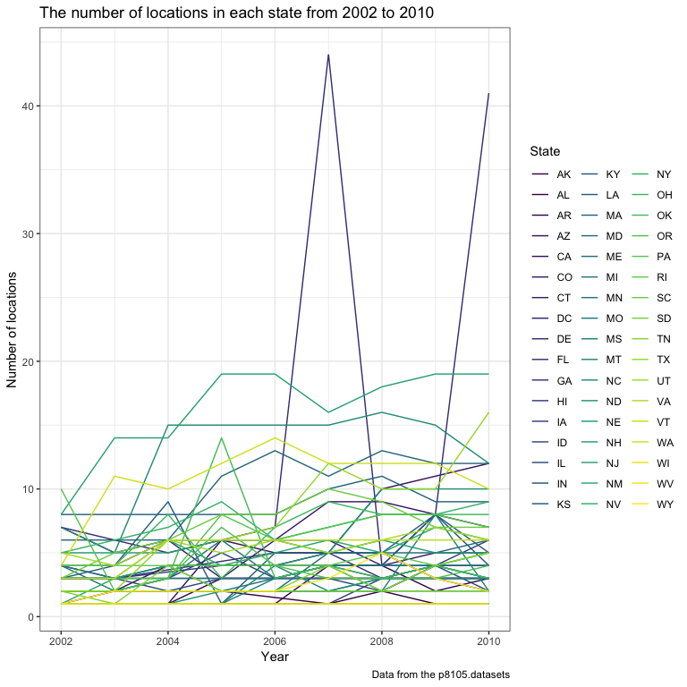

p8105\_hw3\_tl2882
================
Tian Li
2018-10-09

``` r
# install.packages("devtools")
devtools::install_github("p8105/p8105.datasets")
```

    ## Skipping install of 'p8105.datasets' from a github remote, the SHA1 (21f5ad1c) has not changed since last install.
    ##   Use `force = TRUE` to force installation

``` r
library(p8105.datasets)
```

Problem 1
=========

Read and clean brfss\_smart2010
-------------------------------

``` r
brfss = brfss_smart2010 %>% 
  janitor::clean_names() %>%
  filter(topic == "Overall Health") %>% 
  mutate(response = factor(response, levels = c("Excellent", "Very good", "Good", "Fair", "Poor"))) %>% 
  arrange(year, locationdesc, response)
```

Problem 1.1
-----------

``` r
brfss %>%  
  filter(year == "2002") %>% 
  group_by(locationabbr) %>%
  summarize(n_locations = n_distinct(locationdesc)) %>% 
  filter(n_locations == 7)
```

    ## # A tibble: 3 x 2
    ##   locationabbr n_locations
    ##   <chr>              <int>
    ## 1 CT                     7
    ## 2 FL                     7
    ## 3 NC                     7

In 2002, CT, FL, and NC states were observed at 7 locations.

Problem 1.2
-----------

``` r
brfss %>%  
  group_by(year, locationabbr) %>%
  summarize(n_locations = n_distinct(locationdesc)) %>%
  ggplot(aes(x = year, y = n_locations, color = locationabbr)) + 
    geom_line() + 
    labs(title = "The number of locations in each state from 2002 to 2010",
         x = "Year", 
         y = "Number of locations", 
         caption = "Data from the p8105.datasets") + 
    viridis::scale_color_viridis(name = "State", discrete = TRUE) +
    theme(legend.position = "right")
```



This is the “spaghetti plot” that shows the number of locations in each state from 2002 to 2010.
Y is "Number of observations", X is "Year", and each line represents a different state.

Problem 1.3
-----------

``` r
brfss %>%  
  filter(year == "2002" | year == "2006" | year == "2010") %>% 
  filter(locationabbr == "NY", response == "Excellent") %>%
  group_by(year) %>% 
  summarize(excellent_mean = mean(data_value),
            excellent_sd = sd(data_value)) %>% 
  knitr::kable(digits = 1)
```

|  year|  excellent\_mean|  excellent\_sd|
|-----:|----------------:|--------------:|
|  2002|             24.0|            4.5|
|  2006|             22.5|            4.0|
|  2010|             22.7|            3.6|

This is the table showing, for the years 2002, 2006, and 2010, the mean (as in "excellent\_mean") and standard deviation (as in "excellent\_sd") of the proportion of “Excellent” responses across locations in NY State.

Problem 1.4
-----------

``` r
brfss %>% 
  group_by(year, locationabbr, response) %>% 
  summarize(proportion_mean = mean(data_value)) %>% 
  ggplot(aes(x = year, y = proportion_mean, color = locationabbr)) + 
    geom_line() + 
    labs(
      title =
        "Distribution of these state-level averages over time (for each response separately)",
      caption = "Data from the p8105.datasets") + 
    theme(axis.text.x = element_text(angle = 90)) +
    facet_grid(~response) + 
    viridis::scale_fill_viridis(discrete = TRUE)
```

    ## Warning: Removed 1 rows containing missing values (geom_path).


-   I chose "geom\_line" because line chart shows the trend of data at equal time intervals, which reflects the distribution of these state-level averages over time best.

This is the five-panel plot that shows, for each response category separately, the distribution of these state-level averages over time.

Problem 2
=========

``` r
head(instacart)
```

    ## # A tibble: 6 x 15
    ##   order_id product_id add_to_cart_ord… reordered user_id eval_set
    ##      <int>      <int>            <int>     <int>   <int> <chr>   
    ## 1        1      49302                1         1  112108 train   
    ## 2        1      11109                2         1  112108 train   
    ## 3        1      10246                3         0  112108 train   
    ## 4        1      49683                4         0  112108 train   
    ## 5        1      43633                5         1  112108 train   
    ## 6        1      13176                6         0  112108 train   
    ## # ... with 9 more variables: order_number <int>, order_dow <int>,
    ## #   order_hour_of_day <int>, days_since_prior_order <int>,
    ## #   product_name <chr>, aisle_id <int>, department_id <int>, aisle <chr>,
    ## #   department <chr>

Exploration of this dataset
---------------------------

This is data from a deliver company named Instacart.

It is a 1,384,617 rows X 15 columns data frame, which means it has 1,384,617 observations and 15 variables.

The tpypes of "eval\_set", "product\_name", "aisle" and "department" are "character", others are "int".

Key variable: "order\_id" and "product\_id".
With the order ID and product ID (or product name), we can specify every observation.

Illustrative examples of observations:
For example,
for order ID 1 (order number 4), it means that a person (user ID 112108) orderd 8 items at 10:00, Thursday, 9 days after last order.

Those items are: "Bulgarian Yogurt", "Organic 4% Milk Fat Whole Milk Cottage Cheese", "Organic Celery Hearts", "Cucumber Kirby", "Lightly Smoked Sardines in Olive Oil", "Bag of Organic Bananas", "Organic Hass Avocado", "Organic Whole String Cheese".

They are from aisle "yogurt", "other creams cheeses", "fresh vegetables", "fresh vegetables", "canned meat seafood", "fresh fruits", "fresh fruits", "packaged cheese" respectively.

They are from department "dairy eggs", "dairy eggs", "produce", "produce", "canned goods", "produce", "produce", "dairy eggs" respectively.

Problem 2.1
-----------

``` r
unique(instacart$aisle) %>% 
  length()
```

    ## [1] 134

``` r
instacart %>% 
  count(aisle) %>% 
  filter(min_rank(desc(n)) == 1)
```

    ## # A tibble: 1 x 2
    ##   aisle                 n
    ##   <chr>             <int>
    ## 1 fresh vegetables 150609

There are 134 aisles, and the "fresh vegetables" is the most items ordered from.

Problem 2.2
-----------

``` r
library(patchwork)

p1 =
  instacart %>% 
  filter(aisle_id <= 15) %>% 
  ggplot(aes(x = factor(aisle_id))) + ylim(0,151000) + 
    geom_bar() +
    labs(title = "Number of items
in each aisle (ID 1-15)") 
    
p2 =
  instacart %>% 
  filter(aisle_id > 15, aisle_id <= 30) %>% 
  ggplot(aes(x = factor(aisle_id))) + ylim(0,151000) + 
    geom_bar() + 
    labs(title = "Number of items 
in each aisle (ID 16-30)")

p3 =
  instacart %>% 
  filter(aisle_id > 30, aisle_id <= 45) %>% 
  ggplot(aes(x = factor(aisle_id))) + ylim(0,151000) + 
    geom_bar() + 
    labs(title = "Number of items
in each aisle (ID 31-45)") 

p4 =
  instacart %>% 
  filter(aisle_id > 45, aisle_id <= 60) %>% 
  ggplot(aes(x = factor(aisle_id))) + ylim(0,151000) + 
    geom_bar() + 
    labs(title = "Number of items
in each aisle (ID 46-60)")

p5 =
  instacart %>% 
  filter(aisle_id > 60, aisle_id <= 75) %>% 
  ggplot(aes(x = factor(aisle_id))) + ylim(0,151000) + 
    geom_bar() + 
    labs(title = "Number of items
in each aisle (ID 61-75)") 

p6 =
  instacart %>% 
  filter(aisle_id > 75, aisle_id <= 90) %>% 
  ggplot(aes(x = factor(aisle_id))) + ylim(0,151000) + 
    geom_bar() + 
    labs(title = "Number of items
in each aisle (ID 77-90)")

p7 =
  instacart %>% 
  filter(aisle_id > 90, aisle_id <= 105) %>% 
  ggplot(aes(x = factor(aisle_id))) + ylim(0,151000) + 
    geom_bar() + 
    labs(title = "Number of items
in each aisle (ID 91-105)")

p8 =
  instacart %>% 
  filter(aisle_id > 105) %>% 
  ggplot(aes(x = factor(aisle_id))) + ylim(0,151000) + 
    geom_bar() + 
    labs(title = "Number of items
in each aisle (ID 106-134)")

(p1 | p2 | p3) / (p4 | p5 | p6) / (p7 | p8)
```


-   I chose "geom\_bar" because it can show the number of items in each aisle most clearly.
    Because there are too many aisles, I separate them to 8 figures according to the aisle ID. And I make sure that the limits of y are all (0,151000).

This is the plot that shows the number of items ordered in each aisle.

Problem 2.3
-----------

``` r
instacart %>% 
  filter(aisle == "baking ingredients" | aisle == "dog food care" | 
         aisle == "packaged vegetables fruits") %>% 
  group_by(aisle, product_name) %>% 
  summarize(n = n()) %>% 
  filter(min_rank(desc(n)) == 1) %>% 
  knitr::kable(digits = 1)
```

| aisle                      | product\_name                                 |     n|
|:---------------------------|:----------------------------------------------|-----:|
| baking ingredients         | Light Brown Sugar                             |   499|
| dog food care              | Snack Sticks Chicken & Rice Recipe Dog Treats |    30|
| packaged vegetables fruits | Organic Baby Spinach                          |  9784|

This is the table showing the most popular item in each of the aisles “baking ingredients”, “dog food care”, and “packaged vegetables fruits”.

Problem 2.4
-----------

``` r
instacart %>% 
  filter(product_name == "Pink Lady Apples" | product_name == "Coffee Ice Cream") %>% 
  group_by(product_name, order_dow) %>% 
  summarise(mean_hour = mean(order_hour_of_day)) %>% 
  spread(key = order_dow, value = mean_hour) %>% 
  rename('Sun.' = '0', 'Mon.' = '1', 'Tues.' = '2', 'Wed.' = '3', 'Thur.' = '4', 
         'Fri.' = '5', 'Sat.' = '6') %>% 
  knitr::kable(digits = 1)
```

| product\_name    |  Sun.|  Mon.|  Tues.|  Wed.|  Thur.|  Fri.|  Sat.|
|:-----------------|-----:|-----:|------:|-----:|------:|-----:|-----:|
| Coffee Ice Cream |  13.8|  14.3|   15.4|  15.3|   15.2|  12.3|  13.8|
| Pink Lady Apples |  13.4|  11.4|   11.7|  14.2|   11.6|  12.8|  11.9|

This is the table showing the mean hour of the day at which Pink Lady Apples and Coffee Ice Cream are ordered on each day of the week.

Problem 3
=========

``` r
head(ny_noaa)
```

    ## # A tibble: 6 x 7
    ##   id          date        prcp  snow  snwd tmax  tmin 
    ##   <chr>       <date>     <int> <int> <int> <chr> <chr>
    ## 1 US1NYAB0001 2007-11-01    NA    NA    NA <NA>  <NA> 
    ## 2 US1NYAB0001 2007-11-02    NA    NA    NA <NA>  <NA> 
    ## 3 US1NYAB0001 2007-11-03    NA    NA    NA <NA>  <NA> 
    ## 4 US1NYAB0001 2007-11-04    NA    NA    NA <NA>  <NA> 
    ## 5 US1NYAB0001 2007-11-05    NA    NA    NA <NA>  <NA> 
    ## 6 US1NYAB0001 2007-11-06    NA    NA    NA <NA>  <NA>

This is data from a deliver company named Instacart.

It is a 2,595,176 rows X 7 columns data frame, which means it has 2,595,176 observations and 7 variables.

Those 7 variables are: "id": <chr> Weather station ID "date": <date> Date of observation "prcp": <int> Precipitation (tenths of mm) "snow": <int> Snowfall (mm) "snwd": <int> Snow depth (mm) "tmax": <chr> Maximum temperature (tenths of degrees C) "tmin": <chr> Minimum temperature (tenths of degrees C)

Key variable: "id" and "date" With the ID and the date, we can specify every observation.

Missing data:

"prcp": `145838` observations are missing, proportion:`0.0561958`

"snow": `381221` observations are missing, proportion: `0.146896`

"snwd": `591786` observations are missing, proportion: `0.2280331`

"tmax": `1134358` observations are missing, proportion: `0.4371025`

"tmin": `1134420` observations are missing, proportion: `0.4371264`

Reason: (Acccording to website description)

"About one half of the stations report precipitation only. Both the record length and period of record vary by station and cover intervals ranging from less than a year to more than 175 years."

Problem 3.1
-----------

``` r
ny_noaa_tidy = 
  ny_noaa %>% 
  mutate(tmax = as.numeric(tmax), tmin = as.numeric(tmin)) %>% 
  mutate(prcp = prcp/10, tmax = tmax/10, tmin = tmin/10) %>%
  separate(date, into = c("year", "month", "day"), sep = "-") 
```

For data cleaning, I change the types of "tmax" and "tmin" from <chr> to <dbl>.

And I change the unit of "prcp" from (tenths of mm) to (mm).

And I change the unit of "tmax" and "tmin" from (tenths of degrees C) to (degrees C).

``` r
ny_noaa_tidy %>% 
  count(snow) %>% 
  arrange(desc(n))
```

    ## # A tibble: 282 x 2
    ##     snow       n
    ##    <int>   <int>
    ##  1     0 2008508
    ##  2    NA  381221
    ##  3    25   31022
    ##  4    13   23095
    ##  5    51   18274
    ##  6    76   10173
    ##  7     8    9962
    ##  8     5    9748
    ##  9    38    9197
    ## 10     3    8790
    ## # ... with 272 more rows

For snowfall, "0" is the most commonly observed value.

Because in most of the days, new york doen't snow.
